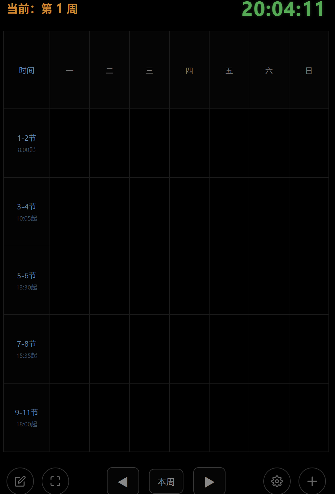

# 📱 Smartphone_Timetable

**Smart OLED Timetable** 是一个基于 Python 的课表生成器，旨在帮助学生和极客**将闲置的旧手机（尤其是 OLED 屏幕手机）完美改造为一块桌面智能副屏**。

只需在电脑端运行 Python 脚本，即可一键生成属于你的专属 HTML 单文件应用。它不仅拥有极简的暗黑 UI，还内置了工业级的防烧屏机制、手势交互系统以及智能排课算法。无需任何服务器部署，完全本地运行！

  

---

## ✨ 核心特性 (Features)

### 🛡️ 1. 终极 OLED 防烧屏设计 (Ultimate Anti Burn-in)
* **True Black 纯黑物理断电**：背景采用 `#000000` 纯黑，让 OLED 屏幕 80% 以上的像素点彻底断电，极致省电。
* **全时段像素微动 (Pixel Shifting)**：每 60 秒自动在极小范围内平移整个界面，杜绝静态残影。
* **去面状 UI**：所有按钮均采用 1px 细线空心设计（纯手工 SVG 绘制），消灭高亮色块死角。

### 🧠 2. 智能作息与防误触拦截
* **全局作息设定**：在手机端 `⚙️设置` 中自定义睡眠与唤醒时间（如 23:00 自动深度息屏，06:55 自动亮起）。
* **渐进式休眠**：长时间不操作进入半暗模式（Dimmed），再进入全黑。
* **唤醒防误触**：从半暗状态点击屏幕，第一下自动拦截操作指令，仅用于恢复 100% 亮度并“续杯”倒计时。

### 👆 3. 极客手势交互 OS
告别繁琐的层级菜单，副屏就该用直觉操作：
* **三击时间**：强制调用安卓底层 API 进入绝对沉浸的全屏模式。
* **双击空白处**：原地生成专属「悬浮备忘录 / 便签」，回车保存。
* **单击课程块**：弹出精美暗黑编辑框，支持修改、删除。

### 🧮 4. 无感排课与局部覆盖算法
* 支持在同一时间、同一格子内塞入无限多门**不同周次**的课程。
* **智能差集运算**：当新旧课程发生周次冲突时，系统会弹出红色警告，并支持“非破坏性局部覆盖”（例如：用 2-9周 的新课自动截断原有 1-16周 的旧课，使其变为仅第 1 周存在）。

### 💾 5. 本地沙盒，数据永存
* 断网可用！所有的排课数据、系统设置、便签坐标均通过 JSON 格式加密存储在浏览器本地的 `LocalStorage` 中。刷新、重启绝不丢失。

---

## 🚀 快速开始 (Quick Start)

### 第 1 步：在电脑端生成你的课表
1. 确保电脑已安装 Python 3.x 环境。
2. 下载本项目，运行 `TimetableGenerator.py`。
3. 在弹出的可视化界面中：
   - 选择你开学第一周的“星期一”日期。
   - （可选）在网格中预填几门课程。
4. 点击右下角的 **“导出并自定义保存位置”**，生成一个 `index.html` 文件。

### 第 2 步：在旧手机上部署运行
1. 将生成的 `index.html` 文件发送到你的闲置手机上。
2. 使用手机浏览器（推荐使用纯净的 **Via浏览器** 或 **Chrome**）打开该文件。
3. **连续点击屏幕顶部的大时钟 3 次**，进入沉浸式全屏。
4. 点击右下角 `⚙️` 齿轮，输入你的手机屏幕比例（如 19.5 : 9），表格会自动缩放至完美填满屏幕。
5. 把它放在手机支架上，享受你的极客桌面副屏吧！

---

## 🛠️ 技术栈
* **生成器端 (PC)**: Python 3, Tkinter
* **客户端 (手机)**: Vanilla JavaScript (ES6), HTML5, CSS3 (纯手写无任何第三方框架依赖)

---

## 💡 常见问题 (FAQ)

**Q: 网页关掉后，我后来在手机上加的课会消失吗？** A: 绝对不会。底层的 JS 代码会实时捕捉你的每一次修改，并保存在浏览器的 LocalStorage 中。只要你不清理浏览器缓存，它就永远存在。

**Q: 怎么更换主题颜色？** A: 手机界面点击底部的 `⚙️` 图标，可以直接通过系统原生调色盘修改全局强调色（支持大工蓝、猛男粉、琥珀金等任意色彩），实时生效！

---

## 🤝 贡献与反馈
如果你有更多酷炫的想法，欢迎提交 Pull Request 或发起 Issue！让旧手机焕发第二春！
